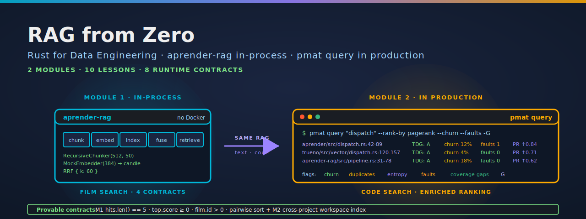

<p align="center">
  
</p>

[](https://github.com/paiml/rag-from-zero/actions/workflows/ci.yml)
[](#license)
[](rust-toolchain.toml)
[](Makefile)
[](contracts/)

# rag-from-zero

Companion repo for **RAG from Zero**, a course in the Coursera **Rust for Data Engineering** specialization (Pragmatic AI Labs · Noah Gift). Two modules, ten lessons, end-to-end from the encode-chunk-index-fuse-retrieve pipeline to shipping a production code-search RAG over your own repos.

The course is anchored on two real Rust tools: **`aprender-rag`** (pure-Rust in-process RAG, no Docker, no model download) for the foundations, and **`pmat query`** (the production code-search RAG that ranks by intent + faults + churn + duplicates + pagerank) for the showcase. No toy fixtures, no hand-waving — every demo runs against a working tool you can use the same day.

## Two backends in this repo

This workspace contains two demos that anchor Module 1's lessons. Both run against the same 50-row Sakila film fixture (`data/films.json`) — same corpus, two paradigms.

### Backend 1 — `aprender-rag` (in-process, no Docker)

```bash
cargo run -p vec-cli --example aprender_film_search
```

Boots a [`trueno_rag::RagPipeline`](https://crates.io/crates/aprender-rag) with `RecursiveChunker(512, 50)` + `MockEmbedder(384)` + `NoOpReranker` + `RRF{k=60}`, indexes every film, queries `"a romantic comedy"`, prints top-5 JSON, asserts four runtime contracts:

* `hits.len() == 5` — top-k honoured
* `hits[0].score >= 0.0` — non-negative top score
* every `id > 0` — Sakila AUTO_INCREMENT positive
* pairwise descending sort

Fully deterministic — same input, same output across runs, processes, and machines.

### Backend 2 — Qdrant (server-backed comparison sidebar)

```bash
make up                                                       # docker compose up -d (Qdrant 1.x)
cargo run -p vec-cli --example qdrant_film_search             # upserts, queries, asserts contracts
```

The Qdrant demo is kept as a comparison sidebar — same fixture, same query, same four contracts, but server-backed via `qdrant-client` on `localhost:6334`. Module 1 mentions it briefly as "what production looks like when in-process is not enough"; the course centers on aprender-rag.

## Production showcase: `pmat query`

Module 2 of the course walks `pmat query` — a production RAG over codebases that ranks by intent + structural signals + git history. The demo is a series of shell commands run against any real Rust project (no per-repo setup needed):

```bash
# Semantic intent search (the RAG primitive)
pmat query "error handling" --limit 10

# Enriched ranking — pagerank + churn + duplicates + entropy + faults + git-history fusion
pmat query "dispatch" --rank-by pagerank --churn --duplicates --faults -G

# Coverage gaps as RAG-driven test prioritization
pmat query --coverage-gaps --rank-by impact --limit 20

# Cross-project search across the workspace index
pmat query "simd" --include-project ../trueno --include-source
```

`pmat query` is the same RAG concepts (encode, index, fuse, rank) applied to source code instead of text — and it's what the course's M2 lessons walk in detail.

## Quick start

```bash
git clone https://github.com/paiml/rag-from-zero
cd rag-from-zero
cargo test --workspace          # unit tests (no Docker required)
make seed                       # in-process aprender demo (no Docker)
make up && make qdrant-demo     # server-backed Qdrant comparison
```

Run `make help` for every target. `make verify` runs `cargo fmt --check`, `cargo clippy -D warnings`, the workspace test suite, and `pv lint contracts/` in one shot — same gate CI runs.

## Workspace layout

```
crates/
├── vec-core/          distance metrics + shared error types
├── vec-embed/         Embedder trait + deterministic HashEmbedder
├── vec-search/        RRF fusion + filtered-query builder
├── vec-qdrant/        Qdrant wrapper (Film, FilmHit, QdrantStore)
├── vec-aprender/      in-process FilmRagPipeline (wraps aprender-rag)
└── vec-cli/           clap binary + 2 end-to-end examples
data/films.json        50 Sakila film rows the demos embed
contracts/             provable-contract YAML (linted by `pv lint`)
compose.yml            local Qdrant 1.x service (sidebar only)
Makefile               same gates CI runs
```

## Provable contracts

Every demo binary asserts runtime invariants — see [`contracts/vec-rust-v1.yaml`](contracts/vec-rust-v1.yaml) for the formal spec (`pv lint contracts/` validates the schema). 8 equations (4 per backend) map 1:1 to `assert!` calls in:

* `crates/vec-cli/examples/aprender_film_search.rs`
* `crates/vec-cli/examples/qdrant_film_search.rs`

Contracts hold for *any* corpus that satisfies the preconditions (non-empty fixture, ≥ top-k rows, positive `film.id` values).

## Course outline

Two modules, ten lessons:

* **Module 1 — aprender-rag: pure-Rust in-process RAG** (5 lessons). The encode → chunk → index → fuse → retrieve pipeline, walked one stage at a time. RecursiveChunker overlap, MockEmbedder for teaching (candle for production), reciprocal-rank fusion, and the closing `aprender_film_search` demo.
* **Module 2 — pmat query: production RAG over codebases** (5 lessons). The pmat query architecture (semantic intent + pagerank + structural signals), enrichment flags walked one-by-one, search modes (semantic, regex, literal, smart-case), coverage gaps as test prioritization, and cross-project search via the workspace index.

The full course ships as part of the **Rust for Data Engineering** specialization on Coursera, alongside ETL Pipelines with Rust, SQL Databases with Rust, MySQL from Zero, Polars from Zero, Rust Serverless, Async Messaging and Queues with Rust, Workflow Orchestration with Rust, and more.

## License

Dual-licensed under either of

- [Apache License, Version 2.0](LICENSE-APACHE)
- [MIT License](LICENSE-MIT)

at your option.
